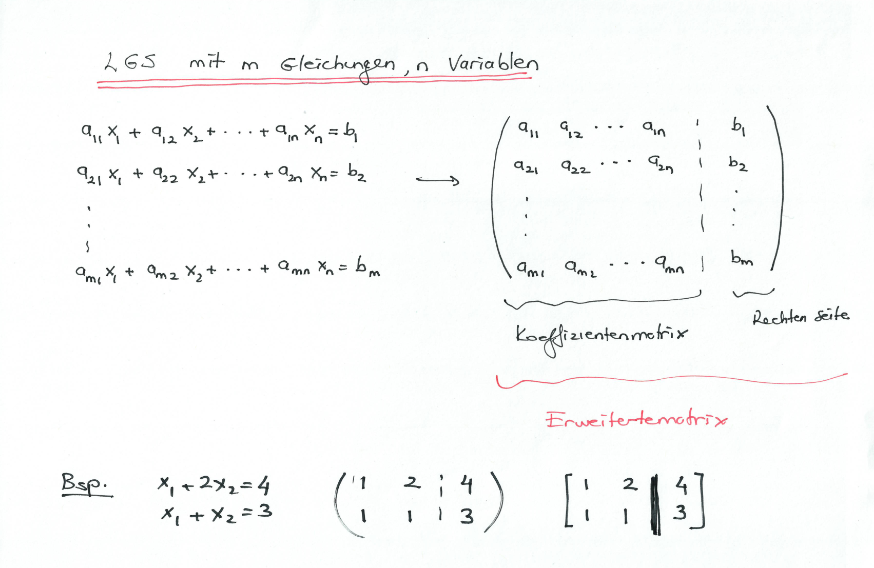

# Linear Systems of Equations (LSE)

## Definitions

**n-tuple**
> The solution of a LSE is an **n-tuple** $(x_1, ..., x_n)$
> of numbers that satisfy all $m$ equations of the system.

**General solution**
> The set of solutions (Lösungsmenge) of the systems is called the **general solution of the system**.

**equivalence**
> Two LSE are **equivalent** if they have the same set of solutions.

**inconsistency**
> A LGS is **inconsistent** when it has no solution.

e.g.
$$
x_1 + 2x_2 = 4 \\\\
3x_1 + 6x_2 = 8 \\\\
$$

**eindeutig loesbar**
> A LGS is **eindeutig loesbar** when is has exactly one solution.

e.g.
$$
x_1 + 2x_2 = 4 \\\\
x_1 + x_2 = 3 \\\\
$$

**mehrdeutig loesbar**
> A LGS is **mehrdeutig loesbar** when is has more than one solution.

e.g.
$$
x_1 + 2x_2 = 4 \\\\
2x_1 + 4x_2 = 8 \\\\
$$

${(4-2\alpha,\alpha)|\alpha \in \mathbb{R}}$

**homogeneous** / **inhomogeneous**
> A SLE is **homogeneous** when the right side is all zeros.
> i.e. $b_1 = b_2 = ... = b_m = 0$
> otherwise it is called **inhomogeneous**

note:
A homogeneous LSE always has at least one solution $(x_1,x_2,...,x_n) = (0,0,...,0)$.
This solution is called Nullloesung or trivial solution. All other solutions are called non trivial.

note:
A homogeneous LSE is always solvable. Either eindeutig (only trivial solution)
or mehrdeutig (trivial + non trivial solutions)

## Related

* [row echelon form](./row-echelon-form)
